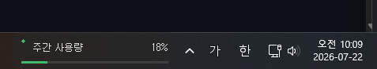

# Codex Usage Monitor

Codex Usage Monitor is a small native Windows widget that shows the current Codex
primary and secondary usage windows in the taskbar and the system tray. It communicates with
the installed Codex CLI's official app-server protocol; it
does not scrape `auth.json` or run a Codex task.



*Compact Windows taskbar widget showing the weekly Codex usage at a glance.*

Codex Usage Monitor는 Codex의 기본·보조 사용량 기간을 작업표시줄, 플로팅 창, 시스템
트레이에 표시하는 소형 네이티브 Windows 위젯입니다. 설치된 Codex CLI의 공식
app-server 프로토콜을 사용하며 `auth.json`을 파싱하거나 Codex 작업을 실행하지 않습니다.

## 한국어

### 화면과 상태

기본 작업표시줄 모드는 약 380×48 논리 픽셀의 두 행에 사용률, 실제 기간(제공될 때),
초기화까지 남은 시간을 표시합니다. 플로팅 모드는 약 380×112 논리 픽셀에 연결 상태와
마지막 정상 갱신 시각을 추가합니다. 트레이 배지는 두 기간 중 더 높은 사용률을
나타냅니다.

텍스트 기준 상태는 다음과 같습니다. 색상만으로 상태를 구분하지 않으며 텍스트와 도형을
함께 사용합니다.

| 사용률 | 상태 | 의미 |
|---:|---|---|
| 0–49% | 안정 | 충분한 여유 |
| 50–74% | 보통 | 일반적인 사용 |
| 75–89% | 주의 | 한도 접근 |
| 90–99% | 위험 | 한도 임박 |
| 100% 이상 | 제한 | 한도 도달 또는 초과 |

API가 100%를 초과한 값을 주면 숫자는 그대로 표시하고 진행 막대만 100%로 제한합니다.
실제 기간이 없을 때만 `단기`·`주간` 레이블을 사용합니다.

### 요구 사항

- Windows 10 또는 Windows 11 (x64)
- 로그인된 Codex CLI 0.141.0 이상. 버전 번호보다 필요한 app-server RPC 지원 여부가
  최종 기준입니다.
- 소스 빌드 시 Rust 1.85+ MSVC 툴체인, Visual Studio 2022 C++ Build Tools, Windows SDK

### 설치, 실행, 빌드

현재는 설치 프로그램이나 WinGet 패키지를 제공하지 않습니다. Windows용 실행 파일은
소스에서 빌드한 뒤 사용자 전용 프로그램 폴더에 복사해 사용합니다. 설치 전에
[Codex CLI](https://github.com/openai/codex)를 설치하고 로그인하세요.

#### 처음 설치

PowerShell에서 다음을 실행합니다. Rust가 아직 없다면 먼저
`winget install Rustlang.Rustup`을 실행하고 PowerShell을 새로 열어 주세요.

```powershell
git clone https://github.com/lch5518/CodexPeek.git
Set-Location .\CodexPeek

rustup toolchain install 1.85-x86_64-pc-windows-msvc `
  --component rustfmt --component clippy
rustup override set 1.85-x86_64-pc-windows-msvc
cargo build --release
```

빌드가 끝나면 아래 명령으로 현재 사용자에게만 설치하고 바로 실행합니다.

```powershell
$installDirectory = Join-Path $env:LOCALAPPDATA "Programs\CodexUsageMonitor"
$source = Join-Path $PWD "target\release\codex-usage-monitor.exe"
$destination = Join-Path $installDirectory "codex-usage-monitor.exe"

New-Item -ItemType Directory -Force $installDirectory | Out-Null
Copy-Item $source $destination -Force
Start-Process $destination
```

이미 실행 중인 위젯을 새 빌드로 교체할 때는 트레이 메뉴에서 **종료**를 먼저 선택하세요.
실행 중인 EXE는 Windows가 잠그므로 종료하지 않으면 `Copy-Item`이 실패합니다.

#### 실행과 진단

```powershell
$app = Join-Path $env:LOCALAPPDATA "Programs\CodexUsageMonitor\codex-usage-monitor.exe"

# 일반 실행
Start-Process $app

# Windows 자동 실행 경로에서만 사용하는 시작 모드
& $app --startup

# UI를 열지 않고 Codex CLI, RPC 연결, 설정을 점검
& $app --diagnose
```

위젯은 기본적으로 작업표시줄 표시를 시도합니다. Windows 셸이 해당 위치에 붙이지 못하면
트레이 아이콘을 유지한 채 플로팅 위젯으로 전환합니다.

#### 개발용 빌드와 검증

Visual Studio 2022 C++ Build Tools와 Windows SDK가 설치된 PowerShell에서 실행합니다.

```powershell
cargo fmt --all -- --check
cargo clippy --all-targets --all-features -- -D warnings
cargo test --all-targets
cargo build --release
.\target\release\codex-usage-monitor.exe --diagnose
```

릴리스 EXE는 `target\release\codex-usage-monitor.exe`에 생성됩니다. 소스를 갱신할 때는
`git pull --ff-only` 후 다시 `cargo build --release`를 실행하고, 기존 위젯을 종료한 다음
위의 설치 복사 명령을 다시 실행하세요.

빌드 스크립트는 저장소의 바이너리 로고를 복사하지 않고 두 개의 사용량 막대를 표현한
16/32/48픽셀 아이콘을 결정적으로 생성합니다. EXE에는 제품 버전 정보,
Per-Monitor V2 DPI, Common Controls v6 매니페스트가 포함됩니다.

### 트레이 메뉴

- **지금 갱신**: 즉시 사용량 조회를 요청합니다. 연속 수동 갱신은 10초 동안 제한됩니다.
- **표시: 작업표시줄 / 플로팅**: 표시 모드를 전환합니다.
- **갱신 간격 1/5/10/15/30분**: 정상 폴링 주기를 바꿉니다.
- **Windows 시작 시 실행**: 현재 EXE의 인용된 경로와 `--startup`을 현재 사용자 Run 키에
  등록·검증하거나 해제합니다.
- **시작: 위젯 표시 / 트레이만**: 자동 실행 시 첫 화면을 선택합니다.
- **인증 갱신**: app-server에 토큰 강제 갱신을 한 번 요청한 뒤 사용량을 다시 조회합니다.
- **자동 인증 갱신**: 일반 조회 실패 시 인증 갱신과 재조회를 각각 한 번 허용할지 정합니다.
- **항상 위**: 플로팅 창의 최상위 표시를 전환합니다.
- **언어 자동/한국어/영어**: Windows UI 언어 자동 감지 또는 고정 언어를 선택합니다.
- **위치 초기화**: 저장된 작업표시줄 오프셋, 모니터, 플로팅 좌표를 초기화합니다.
- **진단**: 민감정보 없는 진단 결과를 별도 창에 표시합니다.
- **업데이트 확인**: 활성화된 빌드에서 최신 릴리스 메타데이터를 확인합니다.
- **위젯 표시/숨기기**: 위젯만 전환하며 트레이는 유지합니다.
- **종료**: 트레이와 창을 정리하고 프로그램을 종료합니다.

### 작업표시줄과 폴백

프로그램은 기본·보조 작업표시줄과 알림 영역의 실제 위치를 찾고 위젯 연결 성공 여부를
검증합니다. 작업표시줄을 찾을 수 없거나, 세로 작업표시줄이거나, Explorer가 교체되거나,
연결/배치에 실패하면 트레이를 유지한 채 안전하게 플로팅 위젯으로 전환합니다. Explorer의
`TaskbarCreated` 메시지를 받으면 재연결을 시도합니다. 저장된 모니터가 사라진 경우
플로팅 창은 사용 가능한 모니터 작업 영역 안으로 복구됩니다.

자동 숨김, Explorer 재시작, 혼합 DPI 같은 셸 동작은 Windows 버전과 셸 구성에 민감합니다.
릴리스 전 수동 검증 항목은 [릴리스 체크리스트](docs/RELEASE_CHECKLIST.md)에 별도로 남겨
두었으며, 아직 수행하지 않은 항목을 검증 완료로 주장하지 않습니다.

### 폴링 동작

- 한 번에 하나의 RPC만 실행하며 전체 조회 제한시간은 30초입니다.
- 실패 후 재시도 간격은 1, 2, 4, 8, 15분으로 증가합니다.
- 마지막 정상 데이터는 실패 중에도 보존합니다.
- 마지막 성공 후 `max(설정 주기 × 2, 10분)`이 지나면 `정보가 오래됨`으로 표시합니다.
- 초기화 시각이 지나면 기존 조회와 중복되지 않는 즉시 갱신을 예약합니다.
- 일반 조회 실패 후 자동 인증 갱신을 켠 경우에도 강제 갱신과 재조회는 각각 한 번뿐입니다.

### 파일 위치와 복구

| 데이터 | 기본 위치 | 내용 |
|---|---|---|
| 설정 | `%APPDATA%\CodexUsageMonitor\settings.json` | 표시 모드, 주기, 위치, 언어 등 |
| 진단 로그 | `%TEMP%\codex-usage-monitor.log` | 안전한 진단 코드와 최소 설명 |
| Codex 인증 파일 | `%USERPROFILE%\.codex\auth.json` | Codex CLI가 소유; 프로그램은 경로와 존재 여부만 진단 |

설정은 임시 파일을 동기화한 뒤 원자적으로 교체합니다. 손상된 설정은
`settings.corrupt-<time>-<process>-<nonce>.json`으로 보존하고 기본값으로 복구합니다.
로그는 1 MiB 직전에 한 번 회전하여 `.log.1`을 유지합니다.

### 네트워크, 개인정보, 보안 경계

사용량 조회는 숨김 프로세스로 실행한 `codex app-server --stdio`와 로컬 JSONL 파이프로
통신합니다. RPC 원문은 제한된 파싱 중에만 일시적으로 처리하며 보관하거나 영구 저장소에
복사하거나 로그로 기록하지 않습니다. 로그인 유형과 `primary`/`secondary`의
`usedPercent`, `windowDurationMins`, `resetsAt`만 형식화된 필드로 역직렬화합니다. 토큰,
계정 ID, 이메일, 인증 파일 원문, 프록시 값은 애플리케이션 데이터로 역직렬화하거나 저장·
기록하지 않습니다.

모니터 자체는 OpenAI에 원시 HTTP 요청을 보내지 않습니다. Codex CLI는 자체 인증·설정·
네트워크 정책에 따라 OpenAI 서비스와 통신할 수 있습니다. 자식 프로세스는 Windows Job
Object에 포함되어 제한시간 초과나 종료 시 프로세스 트리까지 정리됩니다. `codex exec`는
호출하지 않습니다.

현재 `Cargo.toml`에는 의도적으로 `repository`가 없어 업데이트 확인이 네트워크 작업 없이
비활성화됩니다. 나중에 정확한 HTTPS GitHub 저장소가 지정된 경우에만 하루 한 번
`https://api.github.com/repos/<owner>/<repo>/releases/latest`를 제한된 크기·시간으로
조회하고 업데이트 가능 상태만 표시합니다. 사용자가 업데이트 메뉴를 선택한 경우에만 검증된
`https://github.com/<owner>/<repo>/releases/tag/<tag>` 페이지를 기본 브라우저로 엽니다.
실행 파일을 다운로드, 교체, 실행하지 않습니다. 자세한 내용은 [보안 정책](SECURITY.md)을
참조하세요.

### 문제 해결

- **CLI를 찾을 수 없음**: `codex --version`과 `where.exe codex`를 확인하고 CLI 0.141.0
  이상을 PATH에 추가하세요.
- **지원하지 않는 CLI**: Codex CLI를 업데이트하세요. 표시 버전이 충분해도 필요한
  `account/read`, `account/rateLimits/read` RPC가 없으면 지원되지 않습니다.
- **로그인 안 됨/인증 만료**: 터미널에서 Codex CLI의 정상 로그인 흐름을 완료한 뒤
  `인증 갱신`을 선택하세요. 위젯은 대신 로그인을 시작하지 않습니다.
- **작업표시줄에 붙지 않음**: 플로팅 폴백은 의도된 안전 동작입니다. Explorer 재시작 후
  기다리거나 표시 모드를 다시 선택하고, 필요하면 `위치 초기화`를 사용하세요.
- **더 자세한 상태**: `--diagnose` 또는 트레이의 `진단`을 사용하세요. 공유 전에도 로그에
  예상치 못한 개인 정보가 없는지 직접 확인하세요.

### 테스트

```powershell
cargo fmt --all -- --check
cargo clippy --all-targets --all-features -- -D warnings
cargo test --all-targets
cargo build --release
.\target\release\codex-usage-monitor.exe --diagnose
```

자동 테스트는 Windows 10/11, 100/125/150/200% DPI, 다중 모니터, Explorer 재시작,
작업표시줄 자동 숨김의 실제 수동 QA를 대체하지 않습니다.

### 제한 사항과 라이선스

v1에는 자체 업데이트, 직접 `wham/usage` 폴백, Claude/Gemini 지원, 설치 프로그램,
WinGet 배포, 코드 서명이 없습니다. 프로젝트는 [MIT License](LICENSE)로 배포되며,
참고 프로젝트 고지는 [THIRD_PARTY_NOTICES.md](THIRD_PARTY_NOTICES.md)에 있습니다.

---

## English

### Requirements and operation

Codex Usage Monitor is designed for Windows 10/11 x64 and requires a logged-in Codex CLI
0.141.0 or later. Actual support for `account/read` and `account/rateLimits/read` is the
runtime criterion. Source builds require the Rust 1.85+ MSVC toolchain, Visual Studio 2022
C++ Build Tools, and a Windows SDK.

### Installation, running, and building

There is no installer or WinGet package yet. Install from source after installing and
signing in to the [Codex CLI](https://github.com/openai/codex). Clone the repository, build
the release binary, then copy it to the current user's program directory:

```powershell
git clone https://github.com/lch5518/CodexPeek.git
Set-Location .\CodexPeek
rustup toolchain install 1.85-x86_64-pc-windows-msvc --component rustfmt --component clippy
rustup override set 1.85-x86_64-pc-windows-msvc
cargo build --release

$installDirectory = Join-Path $env:LOCALAPPDATA "Programs\CodexUsageMonitor"
New-Item -ItemType Directory -Force $installDirectory | Out-Null
Copy-Item .\target\release\codex-usage-monitor.exe $installDirectory -Force
Start-Process "$installDirectory\codex-usage-monitor.exe"
```

Close the running widget from its tray menu before copying a newer EXE, because Windows
locks a running executable. Run `& "$installDirectory\codex-usage-monitor.exe" --diagnose`
for a no-UI diagnostic check; `--startup` is reserved for the Windows startup registration.
Use `cargo fmt --all -- --check`, `cargo clippy --all-targets --all-features -- -D warnings`,
`cargo test --all-targets`, and `cargo build --release` to verify a source build.

The taskbar widget shows two usage rows. The tray badge reflects the higher percentage. Status
thresholds are Stable 0–49%, Normal 50–74%, Caution 75–89%, Danger 90–99%, and Limited 100%+.
Percentages above 100 remain visible while only the bar is capped. If taskbar discovery,
parenting, geometry, or Explorer recovery fails, the application hides the widget, keeps its
tray icon, and keeps retrying taskbar attachment.

### Tray menu

The menu provides Refresh now; 1/5/10/15/30-minute intervals; Start with Windows; startup as
Widget/Tray only; one-shot authentication refresh; automatic authentication refresh;
Automatic/Korean/English language; Diagnostics; Check for updates; Show/Hide widget; and Exit.

Only one RPC runs at a time, manual refresh has a 10-second cooldown, and failed polls back
off at 1/2/4/8/15 minutes. Last good data is preserved and becomes stale after the greater
of twice the configured interval or 10 minutes. A passed reset time schedules one
non-duplicating refresh.

### Privacy, files, and network

Settings live at `%APPDATA%\CodexUsageMonitor\settings.json`; the one-generation 1 MiB
rotating diagnostic log lives at `%TEMP%\codex-usage-monitor.log`. Diagnostics check only
the path and existence of `%USERPROFILE%\.codex\auth.json` and the presence—not values—of
proxy environment variables.

The app exchanges bounded JSONL with a hidden `codex app-server --stdio` child in a Windows
Job Object. Raw RPC payloads are handled only transiently for bounded parsing; they are not
retained, copied to durable storage, persisted, or logged. Only the login kind and required
rate-limit display fields are deserialized. Tokens, account IDs, email, authentication-file
contents, and proxy values are not deserialized into application data, persisted, or logged.
The app does not invoke `codex exec`. The Codex CLI may contact OpenAI according to its own
policy.

Update checks are currently disabled because package `repository` metadata is intentionally
unset. If an official HTTPS GitHub repository is configured later, the app checks only the
GitHub latest-release API once per day and only presents update-available status. It opens an
exact validated tag page only after an explicit update-menu action. It never downloads,
replaces, or executes an update.

### Troubleshooting, limitations, and license

Run `codex --version`, `where.exe codex`, and then `codex-usage-monitor.exe --diagnose` when
the CLI is missing or unsupported. Complete login through the Codex CLI itself when logged
out. If the taskbar widget is unavailable after an Explorer restart or taskbar geometry change,
the tray icon remains available while the application retries attachment.

The v1 scope excludes self-update, direct `wham/usage` fallback, Claude/Gemini support,
installers, WinGet, and code signing. Automated tests do not claim completion of the manual
Windows/DPI/Explorer matrix in [the release checklist](docs/RELEASE_CHECKLIST.md). The
project uses the [MIT License](LICENSE); attribution is in
[THIRD_PARTY_NOTICES.md](THIRD_PARTY_NOTICES.md), and reporting guidance is in
[SECURITY.md](SECURITY.md).
