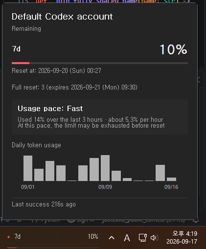

# CodexPeek – Codex Usage Monitor for Windows

**Languages:** [English (default)](../../README.md) · [한국어](README.ko.md) · [Español](README.es.md) · [Português (Brasil)](README.pt-BR.md) · [Bahasa Indonesia](README.id.md) · [日本語](README.ja.md) · [हिन्दी](README.hi.md) · [Deutsch](README.de.md) · [Français](README.fr.md) · [Tiếng Việt](README.vi.md) · [Türkçe](README.tr.md) · [العربية](README.ar.md)

Codex Usage Monitor は、Codex の使用状況をひと目で確認するための小さな Windows ネイティブウィジェットです。
主使用量と副使用量のレート制限ウィンドウを、タスクバー、フローティングウィジェット、システムトレイに表示します。



## ハイライト

- リセット時刻を含む、Codex の主使用量ウィンドウと副使用量ウィンドウを表示します。
- 直近の成功した観測から各ウィンドウの枯渇時期を推定し、使用量の詳細とタスクバーの
  ツールチップに表示します（今回のリリースの新機能）。
- 認証ファイルを解析せず、インストール済み Codex CLI の `app-server` インターフェイスを使用します。
- 最大 8 個の分離された使用量プロファイルから、表示するものを手動で選択できます。
- すべてのタスクバー、またはメインモニターのみにウィジェットを表示できます。
- タスクバーへのアタッチが利用できない場合は、フローティングウィジェットとトレイアイコンへ安全にフォールバックします。
- 手動更新、自動更新間隔、Windows スタートアップ、診断、ローカライズ済み UI に対応しています。

## 仕組み

モニターは `codex app-server --stdio` をローカルの子プロセスとして起動し、標準入力と標準出力を通じて JSONL メッセージをやり取りします。
インストール済みの Codex CLI は自身の認証を処理し、既存の設定とネットワークポリシーに従って OpenAI に接続することがあります。

モニターが要求するのは、表示に必要なサインイン状態と使用量ウィンドウのみです。
Codex タスクを開始したり、`codex exec` を呼び出したりすることはありません。

## 使用量プロファイル

削除できないシステムプロファイル **デフォルトの Codex アカウント** は、CodexPeek の起動時に継承した Codex
ホームを使用し、`CODEX_HOME` が未設定の場合は CLI の既定値を使用します。管理プロファイルは
それぞれ `%APPDATA%\CodexPeek\profiles` 以下に分離された Codex ホームを持ちます。
システムプロファイルを含め、合計 8 個まで登録できます。

プロファイルのラベルはユーザーが指定します。CodexPeek はアカウントのメールアドレスや ID を
調べないため、追加または再ログイン時にはブラウザーで使用する ChatGPT アカウントを確認して
ください。プロファイルの選択で変わるのは、CodexPeek が取得・表示する使用量だけです。
ターミナル、IDE、Codex アプリ、WSL、Remote SSH、Dev Containers のサインインは変わりません。

選択は常に手動です。CodexPeek は残りの上限に応じた自動選択やローテーションを行わず、Codex
の作業をプロファイルへルーティングしません。管理プロファイルを削除すると、分離して保存された
CLI 認証情報を含むローカルデータは復元できないため、確認内容をよく確認してください。

CodexPeek はどのプロファイルの `auth.json` も読み取り、解析、コピーしません。管理プロファイル
に対応する子 `app-server` だけに、その `CODEX_HOME` とファイル認証ストア設定を適用します。
診断には、ラベル、パス、アカウント情報ではなく集計件数だけが記録されます。

### プロファイル マネージャー

システムプロファイルの名前は変更できますが、サインアウトや削除はできません。カスタム名は
CodexPeek の表示だけを変更するもので、アカウント ID ではありません。既定のアカウントで
あることを示す印は、プロファイル マネージャーにだけ表示されます。

トレイの **使用量プロファイル** サブメニューでは、プロファイルの選択と **使用量プロファイルを
管理** の表示だけができます。追加コマンドはありません。プロファイルはマネージャーの一覧の
下にある `+` からだけ追加します。下部に閉じるまたは追加ボタンはありません。マネージャーは
ウィンドウの `X` または Esc で閉じます。

## 要件

- Windows 10 または Windows 11、x64。
- `account/read` と `account/rateLimits/read` をサポートし、サインイン済みの [Codex CLI](https://github.com/openai/codex)。

## ダウンロードと実行

まず、Codex CLI がインストールされ、サインイン済みであることを確認します。

```powershell
codex --version
codex login status
```

### インストーラー (推奨)

1. [最新の GitHub Release](https://github.com/lch5518/CodexPeek/releases/latest) から
   `CodexPeek-Setup-v<version>-x64.exe` をダウンロードします。
2. セットアップを実行し、画面の指示に従います。管理者権限は不要です。
3. Start Menu から **Codex Usage Monitor** を起動します。

### Portable

1. 最新リリースから `codex-peek-v<version>-windows-x86_64-portable.zip` をダウンロードします。
2. ZIP を書き込み可能なフォルダーへ完全に展開します。
3. 展開したフォルダーから `codex-peek.exe` を実行します。

### ソースからビルド

この方法には Rust 1.85 以降、Visual Studio 2022 C++ Build Tools、Windows SDK が必要です。
クローンしたリポジトリからアプリを実行するため、Start Menu ショートカットやアンインストーラーは作成されません。

```powershell
git clone https://github.com/lch5518/CodexPeek.git
Set-Location .\CodexPeek
cargo build --release
.\target\release\codex-peek.exe
```

UI を開かずにビルドと Codex CLI 接続を確認するには、次を実行します。

```powershell
.\target\release\codex-peek.exe --diagnose
```

### Codex にインストールを依頼する

以下のプロンプトを Codex にコピーしてください。このプロンプトは検証済みの Installer を優先し、
互換性のある Release アセットが利用できない場合にのみソースビルドへフォールバックします。

```text
この Windows x64 コンピューターに CodexPeek をインストールし、検証まで完了してください。

1. これが Windows x64 であることを確認し、`codex --version` と `codex login status` を実行してください。
2. 公式リポジトリとその Releases のみを使用してください。
   https://github.com/lch5518/CodexPeek
3. 最新の `CodexPeek-Setup-v<version>-x64.exe` を優先してください。`SHA256SUMS.txt` と
   一緒にダウンロードし、そのファイル内で正確な Installer の項目を見つけ、Installer の
   SHA-256 を計算し、ハッシュが一致する場合にのみ続行してください。セキュリティ制御を
   無効にしたり、チェックサムが欠落または不一致のファイルを実行したりしないでください。
4. 管理者権限を要求せず、現在のユーザー向けにインストールしてください。既存の
   CodexPeek 設定を保持し、実行中のアプリや無関係なプロセスを停止しないでください。
   私が自分でアプリを閉じる必要がある場合は知らせてください。
5. 互換性のある Release アセットが利用できない場合にのみ、公式リポジトリをユーザーが
   書き込み可能な新しいディレクトリに clone し、`cargo build --release` を実行してください。
   Git、Rust 1.85+、Visual Studio 2022 C++ Build Tools、または Windows SDK のインストールが
   必要な場合は、何が変わるのかを最初に正確に説明し、私の承認を求めてください。
6. `%USERPROFILE%\.codex\auth.json` の内容を絶対に読んだり表示したりしないでください。
   認証は、インストール済みの Codex CLI を通じてのみ処理する必要があります。
7. インストールまたはビルド後、生成された `codex-peek.exe --diagnose` を実行してください。
   成功した場合は CodexPeek を起動してください。
8. 選択したインストール方法、インストールされたバージョン、実行ファイルの場所、
   チェックサム結果、診断結果を報告してください。何かが失敗した場合は安全に停止し、
   機密情報を露出せずに正確な blocker を説明してください。
```

Installer 版と Portable 版は `%APPDATA%\CodexPeek\settings.json` を使用するため、
切り替えて使う場合も設定は共有されます。インストーラーは Start Menu ショートカットを追加しますが、
既定では Windows スタートアップを有効にしません。

初期リリースはコード署名されていないため、Microsoft Defender SmartScreen が表示される場合があります。
公式リリースからのみダウンロードし、`SHA256SUMS.txt` でファイルを検証してください。

ハッシュ検証、更新、アンインストール動作、診断、トラブルシューティングについては、[詳細なインストールガイド (韓国語)](../INSTALL.md) を参照してください。

## モニターの使い方

トレイメニューを使用して、使用量の更新、1/5/10/15/30 分の更新間隔の選択、ウィジェットの表示または非表示を行います。
Windows スタートアップ、起動時の表示、認証の更新、自動認証更新、言語、診断の設定も提供します。
マルチモニター配置を制御するには、**Widget: all monitors** または **Widget: primary monitor only** を選択します。この選択は再起動後も保持されます。

既定では、対応言語に一致する場合、UI 言語は Windows ロケールに従います。トレイメニューから手動で言語を選ぶこともできます。対応言語は、韓国語、英語、スペイン語、ブラジルポルトガル語、インドネシア語、日本語、ヒンディー語、ドイツ語、フランス語、ベトナム語、トルコ語、アラビア語です。

タスクバーウィジェットは、テキストに Windows のライト/ダークシステムテーマを使用し、背景にはネイティブのタスクバー素材が透けて見えるようにします。

使用量リクエストは一度に 1 件だけ実行されます。失敗したリクエストは遅延を増やしながら再試行され、最後に成功した値は表示されたまま維持されます。

Explorer の再起動やタスクバー配置の変更後にタスクバーウィジェットをアタッチできない場合でも、トレイアイコンは利用でき、モニターは安全に再試行します。

予測は既定で有効で、成功した観測だけを別のローカルファイル
`%APPDATA%\CodexPeek\usage-history.json` に保存します。同じプロファイル、ウィンドウ、
リセット周期の新しいデータが十分に集まった場合だけ推定を表示し、新しいデータの収集中
または古いデータの状態は現在の推定として表示しません。トレイの **Usage forecasting**
サブメニューで無効にするか **Clear usage forecast history** を選べます。管理プロファイルを
削除するとその履歴も削除されます。これはローカルな推定であり、OpenAI の制限ポリシーを
保証するものではなく、履歴がアップロードまたは同期されることもありません。

## プライバシーとセキュリティ

モニターは `%USERPROFILE%\.codex\auth.json` の内容を読み取ったり解析したりしません。
診断では、そのパスが存在するかどうかだけを確認します。

生の RPC レスポンスは、ログイン種別と表示するレート制限フィールドを抽出するために必要な間だけ処理されます。
トークン、アカウント ID、メールアドレス、認証ファイルの内容、プロキシ値は保存されず、ログにも書き込まれません。

設定は `%APPDATA%\CodexPeek\settings.json` に保存されます。
サイズを制限した診断ログは `%TEMP%\codex-peek.log` に保存されます。

`usage-history.json` に保存されるのは、内部プロファイル ID、`Primary` または `Secondary`、
使用率、任意のリセット時刻、成功した観測時刻だけです。メールアドレス、アカウント ID、
プロファイル名やルート、トークン、認証ファイルの内容、会話・プロンプト、プロキシ設定、
生の RPC 応答は保存しません。保持期間は最大 30 日、プロファイル/ウィンドウごとに最大
1,000 サンプルです。同じ値や 5 分未満の間隔の観測はディスク書き込みを減らすため省略
されます。壊れたファイルは隔離またはリセットされ、使用量表示は継続します。

確認後に **Clear usage forecast history** を実行すると全サンプルを削除できます。Installer
と Portable のアンインストールでは `%APPDATA%\CodexPeek` が保持されるため、アプリ削除後も
履歴が残ることがあります。完全に削除するにはトレイ操作を使うか、ファイル/フォルダーを
手動で削除してください。

データ取り扱いと脆弱性報告に関する完全なガイダンスは、[SECURITY.md](../../SECURITY.md) を参照してください。

## トラブルシューティング

| 問題 | 対処方法 |
| --- | --- |
| Codex CLI が見つからない | `codex --version` と `where.exe codex` を実行し、Codex CLI が `PATH` にあることを確認します。 |
| CLI がサポートされていない | Codex CLI を更新してください。表示されるバージョン番号より、必要な RPC サポートの有無が重要です。 |
| ログアウトしている、または認証が期限切れ | Codex CLI で通常のログインフローを完了し、トレイメニューで **Refresh authentication** を選択します。 |
| タスクバーウィジェットが間違ったモニターにある | トレイメニューから **Widget: all monitors** または **Widget: primary monitor only** を選択します。 |
| タスクバーウィジェットが表示されない | フローティングウィジェットまたはトレイアイコンを使用し、必要に応じて Explorer を再起動して、希望するウィジェットのモニターモードを選択します。 |
| さらに詳細が必要 | `--diagnose` を実行するか、トレイメニューから **Diagnostics** を開きます。 |

## 開発

ソースビルドには Rust 1.85 以降、Visual Studio 2022 C++ Build Tools、Windows SDK が必要です。
リポジトリルートからビルドと検証を行います。

```powershell
git clone https://github.com/lch5518/CodexPeek.git
Set-Location .\CodexPeek
cargo fmt --all -- --check
cargo clippy --all-targets --all-features -- -D warnings
cargo test --all-targets
cargo build --release
```

自動チェックは、[リリースチェックリスト](../RELEASE_CHECKLIST.md) にある Windows、DPI、マルチモニター、Explorer 復旧シナリオの代わりにはなりません。

## ❤️ サポート

CodexPeek が時間の節約に役立っている場合は、開発支援をご検討ください。

- ⭐ このリポジトリにスターを付ける
- ❤️ [GitHub でスポンサーになる](https://github.com/sponsors/lch5518)

スポンサーは、このプロジェクトの継続的なメンテナンスに役立ちます。

## ライセンス

このプロジェクトは [MIT License](../../LICENSE) のもとで提供されています。
サードパーティ通知については [THIRD_PARTY_NOTICES.md](../../THIRD_PARTY_NOTICES.md) を参照してください。
