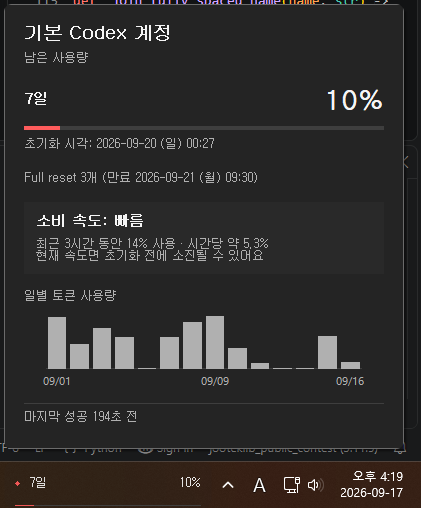

# CodexPeek – Codex Usage Monitor for Windows

**Languages:** [English (default)](../../README.md) · [한국어](README.ko.md) · [Español](README.es.md) · [Português (Brasil)](README.pt-BR.md) · [Bahasa Indonesia](README.id.md) · [日本語](README.ja.md) · [हिन्दी](README.hi.md) · [Deutsch](README.de.md) · [Français](README.fr.md) · [Tiếng Việt](README.vi.md) · [Türkçe](README.tr.md) · [العربية](README.ar.md)

Codex 사용량 모니터는 Codex 사용량을 빠르게 확인하는 Windows 네이티브 위젯입니다.
기본·보조 사용량 기간을 작업 표시줄, 플로팅 위젯, 시스템 트레이에 표시합니다.



## 주요 기능

- Codex 기본·보조 사용량 기간과 초기화 시각을 표시합니다.
- 인증 파일을 직접 파싱하지 않고, 설치된 Codex CLI의 `app-server` 인터페이스를 사용합니다.
- 최대 8개의 격리된 사용량 프로필 중 하나를 수동으로 선택할 수 있습니다.
- 다중 모니터 Windows 환경에서 모든 작업 표시줄 또는 주 모니터에만 위젯을 표시할 수 있습니다.
- 작업 표시줄에 안전하게 붙일 수 없을 때는 플로팅 위젯과 트레이 아이콘으로 동작합니다.
- 수동·자동 갱신, Windows 시작 시 실행, 진단, 지역화된 UI를 지원합니다.

## 작동 방식

모니터는 로컬 자식 프로세스로 `codex app-server --stdio`를 실행하고 표준 입출력으로 JSONL 메시지를 주고받습니다.
인증은 설치된 Codex CLI가 기존 설정과 네트워크 정책에 따라 처리하며, 필요하면 OpenAI와 통신할 수 있습니다.

모니터는 로그인 상태와 화면 표시에 필요한 사용량 기간만 요청합니다.
Codex 작업을 시작하거나 `codex exec`를 호출하지 않습니다.

## 사용량 프로필

삭제할 수 없는 **기본 Codex 계정** 프로필은 CodexPeek 시작 시 상속한 Codex 홈을 사용하며,
`CODEX_HOME`이 없으면 CLI 기본값을 사용합니다. 관리 프로필을 추가하면 각각
`%APPDATA%\CodexPeek\profiles` 아래의 분리된 Codex 홈을 사용합니다. 시스템 프로필을
포함해 전체 8개까지 만들 수 있습니다.

프로필 표시명은 사용자가 직접 지정합니다. CodexPeek은 계정 이메일이나 ID를 확인하지 않으므로
계정을 추가하거나 다시 로그인할 때 브라우저에서 사용할 ChatGPT 계정을 직접 확인하세요. 프로필
선택은 CodexPeek이 조회하고 표시하는 사용량만 바꿉니다. 터미널, IDE, Codex 앱, WSL,
Remote SSH, Dev Containers의 로그인은 바뀌지 않습니다.

선택은 항상 수동입니다. CodexPeek은 남은 한도에 따라 프로필을 자동 선택·순환하거나 Codex 작업을
특정 프로필로 라우팅하지 않습니다. 관리 프로필을 삭제하면 그 안에 별도로 저장된 CLI 인증 정보를
포함한 로컬 프로필 데이터를 복구할 수 없으므로 확인 안내를 주의 깊게 읽으세요.

CodexPeek은 어떤 프로필의 `auth.json`도 읽거나 파싱하거나 복사하지 않습니다. 관리 프로필의
자식 `app-server`에만 해당 `CODEX_HOME`과 파일 인증 저장소 설정을 적용하며, 진단에는 프로필
표시명·경로·계정 정보 없이 집계된 개수만 기록합니다.

## 요구 사항

- Windows 10 또는 Windows 11, x64.
- `account/read`, `account/rateLimits/read` RPC를 지원하는 로그인된 [Codex CLI](https://github.com/openai/codex).

## 다운로드 및 실행

먼저 PowerShell에서 Codex CLI 설치와 로그인 상태를 확인하세요.

```powershell
codex --version
codex login status
```

### 설치 프로그램(권장)

1. [최신 GitHub Release](https://github.com/lch5518/CodexPeek/releases/latest)에서
   `CodexPeek-Setup-v<version>-x64.exe`를 다운로드합니다.
2. 설치 프로그램을 실행하고 안내에 따라 설치합니다. 관리자 권한은 필요하지 않습니다.
3. 설치가 끝나면 시작 메뉴에서 **Codex Usage Monitor**를 실행합니다.

### Portable

1. 최신 Release에서
   `codex-peek-v<version>-windows-x86_64-portable.zip`을 다운로드합니다.
2. ZIP을 쓰기 가능한 폴더에 완전히 압축 해제합니다.
3. 압축을 푼 폴더에서 `codex-peek.exe`를 실행합니다.

### 소스에서 직접 빌드

Rust 1.85 이상, Visual Studio 2022 C++ Build Tools, Windows SDK가 필요합니다.
이 방법은 복제한 저장소에서 앱을 실행하며 시작 메뉴 바로 가기와 제거 프로그램을
만들지 않습니다.

```powershell
git clone https://github.com/lch5518/CodexPeek.git
Set-Location .\CodexPeek
cargo build --release
.\target\release\codex-peek.exe
```

UI를 열지 않고 빌드 결과와 Codex CLI 연결을 확인하려면 다음을 실행합니다.

```powershell
.\target\release\codex-peek.exe --diagnose
```

### Codex에 설치 요청

아래 프롬프트를 그대로 Codex에 복사하세요. 검증된 Installer를 우선 사용하고, 호환되는
Release 파일이 없을 때만 소스 빌드로 전환합니다.

```text
이 Windows x64 컴퓨터에 CodexPeek를 설치하고 검증까지 완료해줘.

1. Windows x64 환경인지 확인하고 `codex --version`과 `codex login status`를 실행해줘.
2. 다음 공식 저장소와 그 Releases만 사용해줘.
   https://github.com/lch5518/CodexPeek
3. 최신 `CodexPeek-Setup-v<version>-x64.exe`를 우선 사용해줘. Installer와
   `SHA256SUMS.txt`를 함께 다운로드하고, 체크섬 파일에서 Installer의 정확한 항목을
   찾은 다음 직접 계산한 SHA-256과 비교해줘. 해시가 일치할 때만 진행하고, 보안 기능을
   끄거나 체크섬이 없거나 다른 파일을 실행하지 마.
4. 관리자 권한을 요청하지 말고 현재 사용자용으로 설치해줘. 기존 CodexPeek 설정은
   보존하고, 실행 중인 앱이나 관련 없는 프로세스를 임의로 종료하지 말아줘. 앱을
   종료해야 한다면 내가 직접 종료할 수 있도록 먼저 알려줘.
5. 호환되는 Release 파일을 사용할 수 없을 때만 공식 저장소를 쓰기 가능한 새 사용자
   폴더에 clone하고 `cargo build --release`를 실행해줘. Git, Rust 1.85 이상,
   Visual Studio 2022 C++ Build Tools 또는 Windows SDK 설치가 필요하면 무엇이
   변경되는지 먼저 설명하고 내 승인을 받아줘.
6. `%USERPROFILE%\.codex\auth.json`의 내용을 읽거나 출력하지 마. 인증은 설치된
   Codex CLI를 통해서만 처리해줘.
7. 설치 또는 빌드 후 생성된 `codex-peek.exe --diagnose`를 실행해줘. 진단에 성공하면
   CodexPeek를 실행해줘.
8. 사용한 설치 방식, 설치된 버전, 실행 파일 위치, 체크섬 결과와 진단 결과를 알려줘.
   실패하면 민감 정보를 노출하지 말고 안전하게 중단한 뒤 정확한 원인을 설명해줘.
```

Installer와 Portable은 `%APPDATA%\CodexPeek\settings.json`을 사용하므로 전환해도
설정을 공유합니다. Installer는 시작 메뉴 바로 가기를 만들지만 Windows 자동 시작은
기본으로 활성화하지 않습니다.

초기 릴리스는 코드 서명되지 않아 Microsoft Defender SmartScreen 경고가 나타날 수
있습니다. 공식 Release에서만 다운로드하고 `SHA256SUMS.txt`로 파일을 검증하세요.

해시 확인, 업데이트, 제거와 문제 해결은 [상세 설치 가이드](../INSTALL.md)를
참고하세요.

## 사용 방법

트레이 메뉴에서 사용량을 새로 고치고 1/5/10/15/30분 갱신 간격을 선택하거나 위젯을 표시·숨길 수 있습니다.
Windows 시작, 시작 화면, 인증 갱신, 자동 인증 갱신, 언어, 진단도 여기서 설정합니다.
**위젯: 모든 모니터** 또는 **위젯: 주 모니터만**을 선택해 다중 모니터 표시 범위를 정할 수 있으며, 선택은 다시 시작해도 유지됩니다.

기본값에서는 Windows 로캘이 지원 언어와 일치할 때 UI 언어를 자동으로 따릅니다. 트레이 메뉴에서 언어를 직접 선택할 수도 있습니다. 지원 언어는 한국어, 영어, 스페인어, 브라질 포르투갈어, 인도네시아어, 일본어, 힌디어, 독일어, 프랑스어, 베트남어, 터키어, 아랍어입니다.

작업 표시줄 위젯의 글자색은 Windows의 밝은/어두운 시스템 테마를 따르고, 배경에는 실제 작업 표시줄 재질이 그대로 비칩니다.

사용량 요청은 한 번에 하나만 실행됩니다.
요청이 실패하면 간격을 늘려 재시도하며, 마지막으로 성공한 사용량은 계속 표시합니다.

Explorer 재시작이나 작업 표시줄 배치 변경으로 위젯을 붙이지 못하면 트레이 아이콘은 계속 사용할 수 있습니다.
모니터는 작업 표시줄 연결을 안전하게 다시 시도합니다.

## 개인정보 및 보안

모니터는 `%USERPROFILE%\.codex\auth.json`의 내용을 읽거나 파싱하지 않습니다.
진단에서는 해당 경로의 존재 여부만 확인합니다.

원시 RPC 응답은 로그인 유형과 화면에 표시할 사용량 필드를 추출하는 동안에만 처리합니다.
토큰, 계정 ID, 이메일, 인증 파일 내용, 프록시 값은 저장하거나 로그에 기록하지 않습니다.

설정은 `%APPDATA%\CodexPeek\settings.json`에 저장합니다.
크기가 제한된 진단 로그는 `%TEMP%\codex-peek.log`에 저장합니다.

데이터 처리와 취약점 보고 안내는 [SECURITY.md](../../SECURITY.md)를 참고하세요.

## 문제 해결

| 문제 | 해결 방법 |
| --- | --- |
| Codex CLI를 찾을 수 없음 | `codex --version`, `where.exe codex`를 실행하고 Codex CLI가 `PATH`에 있는지 확인하세요. |
| 지원하지 않는 CLI | Codex CLI를 업데이트하세요. 표시된 버전보다 필요한 RPC 지원 여부가 중요합니다. |
| 로그아웃 또는 인증 만료 | Codex CLI에서 정상 로그인 절차를 완료한 뒤 트레이 메뉴의 **인증 갱신**을 선택하세요. |
| 위젯 표시 범위를 바꾸고 싶음 | 트레이 메뉴에서 **위젯: 모든 모니터** 또는 **위젯: 주 모니터만**을 선택하세요. |
| 작업 표시줄 위젯이 보이지 않음 | 플로팅 위젯이나 트레이 아이콘을 사용하고, 필요하면 Explorer를 다시 시작한 뒤 원하는 위젯 모니터 모드를 선택하세요. |
| 자세한 상태가 필요함 | `--diagnose` 또는 트레이 메뉴의 **진단**을 사용하세요. |

## 개발

소스 빌드에는 Rust 1.85 이상, Visual Studio 2022 C++ Build Tools, Windows SDK가
필요합니다. 저장소 루트에서 빌드하고 검사하세요.

```powershell
git clone https://github.com/lch5518/CodexPeek.git
Set-Location .\CodexPeek
cargo fmt --all -- --check
cargo clippy --all-targets --all-features -- -D warnings
cargo test --all-targets
cargo build --release
```

자동화된 검사는 [릴리스 체크리스트](../RELEASE_CHECKLIST.md)의 Windows, DPI, 다중 모니터, Explorer 복구 검증을 대체하지 않습니다.

## ❤️ 후원

CodexPeek가 시간을 절약해 드린다면 개발을 후원해 주세요.

- ⭐ 이 저장소에 Star 남기기
- ❤️ [GitHub에서 후원하기](https://github.com/sponsors/lch5518)

후원해 주실 때마다 프로젝트를 활발하게 유지하는 데 큰 도움이 됩니다.

## 라이선스

이 프로젝트는 [MIT License](../../LICENSE)로 제공됩니다.
서드파티 고지는 [THIRD_PARTY_NOTICES.md](../../THIRD_PARTY_NOTICES.md)를 참고하세요.
